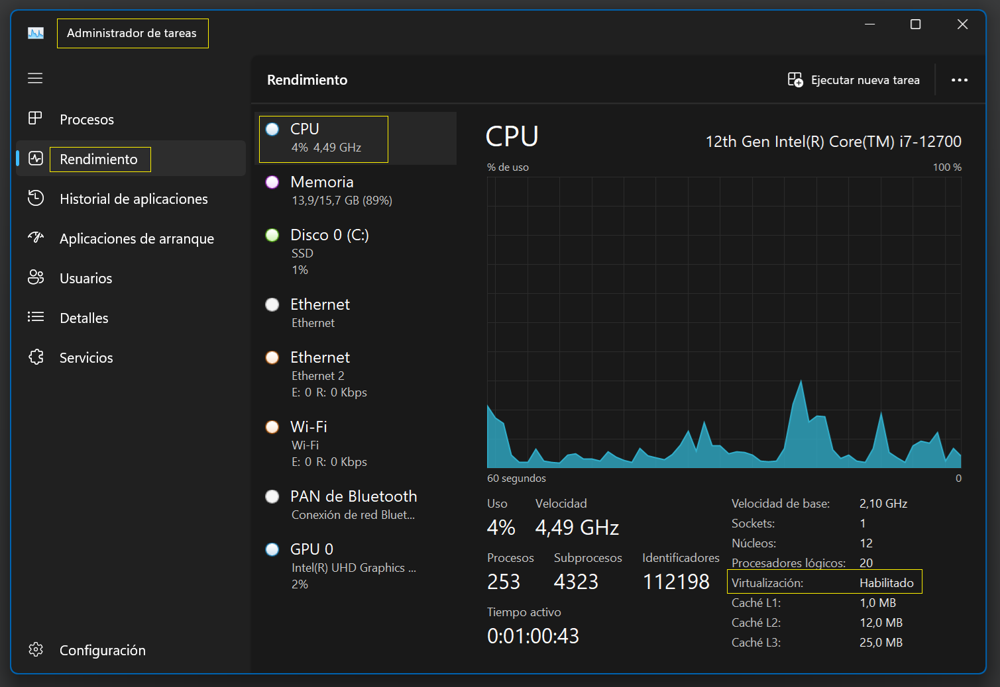

# Pasos para instalar Arch Linux con VirtualBox
___
### ARCHLINUX


## 1. Requisitos
- Virtualización habilitada en la BIOS 
  - Para verificar si la virtualización está habilitada:
  - Abrir administrador de tareas y hacer clic en "Rendimiento". 
  - Luego, hacer clic en "CPU" y buscar la sección "Virtualización". 
  - Si la virtualización está habilitada, debería decir "Habilitado".
  - Imagen de referencia:
  

   
  - Si la virtualización está deshabilitada, se debe habilitar con el siguiente comando:
    - Abrir powershell como administrador y ejecutar el siguiente comando:
    ```bash
      enable -windowsOptionalFeature -Online -FeatureName Microsoft-Hyper-V -All
      ```
- VirtualBox instalado
    - [Descargar VirtualBox](https://www.virtualbox.org/wiki/Downloads)

## 2. Descargar la imagen (ISO) de Arch Linux
[Descargar Arch Linux - Servidor Chile](https://mirror.anquan.cl/archlinux/iso/2024.06.01/)

## 3. Crear una nueva máquina virtual
1. Abrir VirtualBox y hacer clic en **"Nuevo"** para crear una nueva máquina virtual.
2. Asignar un nombre a la máquina virtual: **ArchLinux**
3. Carpeta donde se va almacenar la máquina virtual: **C:\Users\fredy\VirtualBox VMs**
4. Imagen ISO: **_No seleccionar ninguna imagen, ya que se va a instalar desde un archivo ISO._**
3. Seleccionar  tipo: **Linux**
4. Seleccionar versión: **Arch Linux (64-bit)**
- Siguiente...
5. Asignar memoria RAM: **8GB**
6. Procesadores (CPU): **4** 
- Siguiente...
7. Crear un disco duro virtual ahora: **Tamaño del disco duro: 50GB**
- Siguiente...
8. Resumen de la configuración de la máquina virtual
- Finalizar

## 4. Configurar la máquina virtual
1. Seleccionar la máquina virtual ArchLinux y hacer clic en **"Configuración".**
2. En la pestaña **"General"**:
   - seleccionar **"Avanzado"** y seleccionar **"Bidireccional"** en:
     - **"Compartir portapapeles" y "Arrastrar y soltar"**.
3. En la pestaña **"Sistema"**: Valores por defecto.
4. En la pestaña **"Pantalla"**: 
   - Memoria de video: **128MB**
   - Habilitar aceleración 3D: **No marcar**
   - Los demás valores por defecto.
5. En la pestaña **"Almacenamiento"**: **Valores por defecto.**
   - Controlador IDE: Subir el archivo ISO **VBoxGuestAdditions.iso** 
   - Los demás valores por defecto.
6. En la pestaña **"Audio"**: **Valores por defecto.**
7. En la pestaña **"Red"**: 
   - Adaptador 1: **NAT**
   - Los demás valores por defecto.
8. En la pestaña **"Puertos Serie"**: **Valores por defecto.**
9. En la pestaña **"USB"**: **Valores por defecto.**
10. En la pestaña **"Carpetas Compartidas"**: **Valores por defecto.**
11. En la pestaña **"Interfaz de usuario"**: **Valores por defecto.**
12. Finalmente, hacer clic en **"Aceptar"** para guardar la configuración.
13. Iniciar la máquina virtual ArchLinux.


## 5. Instalar Arch Linux
1. Seleccionar "Boot Arch Linux (x86_64)" y presionar "Enter".
- Una vez que termine de instalar, ingresar el siguiente comando para cambiar el tamnaño de fuente: (Opcional)
```bash
setfont ter-132n
```
2. Para comprobar la conexión a Internet, ingresar el siguiente comando:
```bash
ping archilinux.org
```
3. Para sincronizar la lista de paquetes, ingresar el siguiente comando:
```bash
pacman -Sy
```
4. Para instalar el llavero de Arch Linux, que contiene las claves de los paquetes, ingresar el siguiente comando:
```bash
pacman -Sy archlinux-keyring
```
5. Iniciar el instalador de Arch Linux, ingresar el siguiente comando:
```bash
  archinstall
```
6. configurar/modificar las siguientes opciones:
- Archintall language: English
- Mirrors: Chile
- Locales: 
  ~~~
  - keyboard layout: es
  - Locale language: es_PE.UTF-8
  - Locale encoding: UTF-8
  ~~~
- Disk configuration:
  ~~~
  - Use a best-effort default partitioning layout
  ~~~
  
    | Model             | Path     | Tyep | Size      | Free space | Sector size  | Read only |
    |-------------------|----------|------|-----------|------------|--------------|-----------|
    | ATA VBOX HARDDISK | /dev/sda | scsi | 53.00 GiB | 51199      | 512          | False     |
  ~~~
  - btrfs: yes (default)
  - Use compression: yes (default)
  ~~~
- Disk encryption: no
- Bootloader: Grub
- Swap: True
- Hostname: archlinux
- Root password: ********
- User account:
  ~~~
  - Add user:
    - Username: fredy
    - Password: ********
    - Sudo: yes
    - confirm and exit
  ~~~
- Profile:
  
  - Type:
    ~~~
    - Desktop
      - Gnome
    - Grphics driver:
      - VMware / VirtualBox (open-source)
    - Greeter:
      - gdm
    ~~~
- Audio:
  - Pipewire
- Kernels:
  - linux
- Additional packages:
  ```bash
      sudo git neofetch
   ```
- Network configuration:
  - Use NetworkManager (Necessary to configure internet graphicaly in GNOME and KDE)
- Timezone:
  - America/Lima
- Automatic time sync (NTP): True
- Optional repositories: No
- Finalmente: Instal y enter

<!--Importante la descarga se demora dependiendo de la conexión a internet -->
- Would you like to chroot into the newly created installation and perform post-installation configuration?
  - Yes
    - Después de la instalación, se abrirá una terminal con el usuario root:
      - Configurar el usuario root:
      - Opciones de personalización de la instalación:
        ```bash
            neofetch
         ```
        - Instalar paquetes adicionales: 
        ```bash
            sudo pacman -Sy firefox libreoffice-fresh jdk21-openjdk maven intellij-idea-community-edition flatpak make htop
         ```
        - Una vez terminada la instalación, salir del entorno chroot:
        ```bash
            exit 
         ```
        - Apagar la máquina virtual:
        ```bash
             shutdown now
         ```

7. Abrir VirtualBox y seleccionar la máquina virtual ArchLinux.
8. Selecionar "Configuración"
9. Ir a la opción "Almacenamiento"
10. Seleccionar el icono del disco duro y seleccionar "Eliminar"
11. Aceptar y luego iniciar la máquina virtual.
12. Ingresar el usuario y la contraseña creados durante la instalación.
13. Arch Linux se ha instalado correctamente.

## 6. Configurar Arch Linux
1. Para actualizar el sistema, ingresar el siguiente comando:
```bash
sudo pacman -Sy
```
 - Solicitará la contraseña del usuario.
2. Comando para instalar encabezados del kernel:
```bash
sudo pacman -S linux-headers
```
3. Para mejorar la resolución de la pantalla, instalar las Guest Additions:
- Dispositivos -> Insertar imagen de CD de los complementos de invitado
  - Abrir directorio de archivos mediante GUI:
    - ubicar el directorio VBox_GAs_7.0.18
      - Seleccionar y copiar todos los archivos del directorio anterior
      - Luego pegar en el directorio /Documentos
      - Abrir terminal y ejecutar los siguientes comandos:
      ```bash
      cd /Documentos
      ```
      ```bash
      ls -lh
      ```
      - Ubicar el archivo VBoxLinuxAdditions.run y ejecutar el siguiente comando:
      ```bash
        chmod 777 VBoxLinuxAdditions.run
        ```
      - Nuevamente validar el archivo con el comando: (Debe salir en color verde)
      ```bash
        ls -lh
        ```
      - Luego ejecutar el paquete con el siguiente comando:
      ```bash
        sudo ./VBoxLinuxAdditions.run
        ```
      - Con eso se agregarán las Guest Additions a la máquina virtual.
      - Reiniciar la máquina virtual con el siguiente comando:
      ```bash
        sudo reboot now
        ```
      - Una vez reiniciada la máquina virtual, la resolución de la pantalla se habrá mejorado.
      - Para comprobar la resolución de la pantalla, ingresar el siguiente comando:
      ```bash
        neofetch
        ```
## 7. Instalar aplicaciones
1. Para instalar aplicaciones, ingresar el siguiente comando:
```bash
sudo pacman -S firefox libreoffice-fresh jdk21-openjdk maven intellij-idea-community-edition flatpak make htop
```
## 8. Comprobar estado de la máquina virtual con el comando:
1. Este comando muestra información sobre el sistema, como el sistema operativo, la versión del kernel, la memoria, la CPU, la GPU y la resolución de la pantalla.
```bash
sudo htop
```
## 9. Finalmente, Arch Linux se ha instalado correctamente en VirtualBox.

## 10. Referencias
- [Arch Linux Installation Guide - Ksk Royal](https://www.youtube.com/watch?v=FlQ-LyBDCoo&t=630s&ab_channel=KskRoyal)
- [Arch Linux](https://archlinux.org/)
- [VirtualBox](https://www.virtualbox.org/)
- 

## 11. Recursos
- [Arch Linux - Package Repository](https://archlinux.org/packages/?sort=&q=maven&maintainer=&flagged=)

## 12. Conclusión
- Arch Linux es una distribución de Linux ligera y personalizable que se puede instalar en VirtualBox para probar y aprender sobre Linux. Con los pasos anteriores, se puede instalar Arch Linux en VirtualBox y configurarlo para su uso diario.